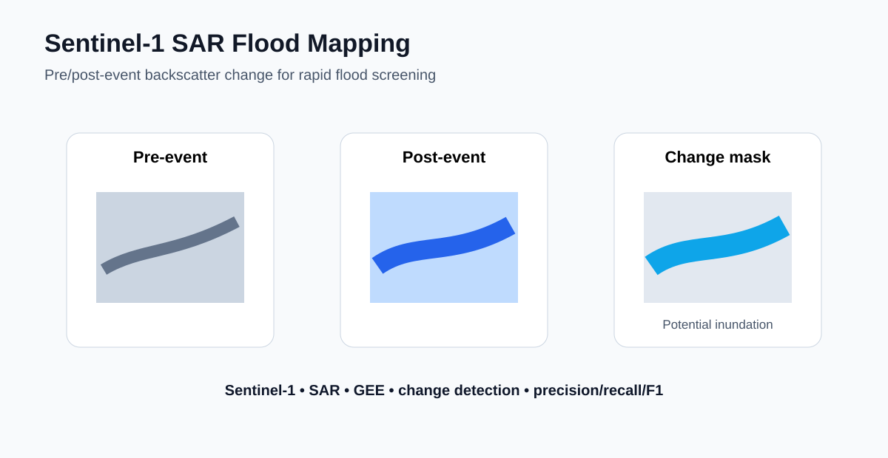
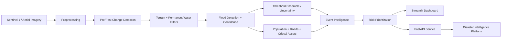
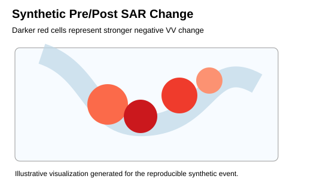
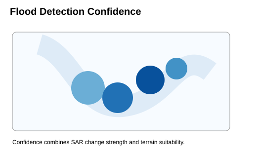
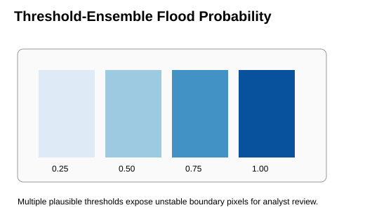
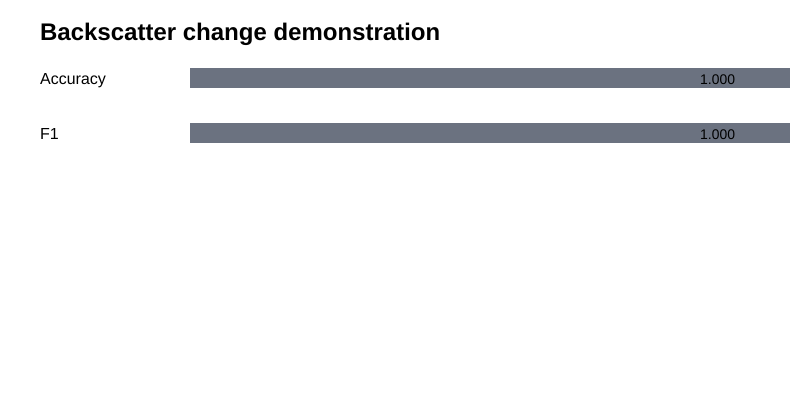
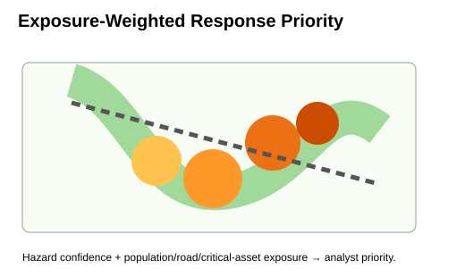

# AI Flood Intelligence & Event Mapping

**Sentinel-1 SAR • Change Detection • Flood Event Mapping • Risk Intelligence • Uncertainty • FastAPI • Streamlit • Google Earth Engine**

A reproducible disaster-intelligence project demonstrating an end-to-end workflow for **rapid flood detection, pre/post-event change analysis, flood-extent mapping, validation, exposure assessment, uncertainty screening, and platform integration**.



## 🌍 Real Public-Data Case Study — Pakistan Floods, August 2022

This repository includes a **real historical Sentinel-1 case study** for the catastrophic August 2022 Pakistan floods in Sindh.

ESA reported that Copernicus Sentinel-1 imagery acquired on **30 August 2022** was used to map flood extent in Pakistan, including the Dera Murad Jamali–Larkana area. The case-study workflow uses the official Earth Engine Sentinel-1 GRD collection and adds permanent-water screening, terrain filtering, flood-area calculation, and a WorldPop exposure overlay.

- Case-study guide: [`real_case_studies/pakistan_2022/README.md`](real_case_studies/pakistan_2022/README.md)
- Real-data Earth Engine workflow: [`real_case_studies/pakistan_2022/pakistan_2022_sentinel1.js`](real_case_studies/pakistan_2022/pakistan_2022_sentinel1.js)
- Historical event reference: ESA *Pakistan inundated* (September 2022)
- Data: Copernicus Sentinel-1 GRD + JRC Global Surface Water + SRTM + WorldPop

> **Important:** the Pakistan script is a reproducible real-data workflow, not a claim that its demonstration threshold exactly reproduces an official Copernicus flood product. Operational accuracy requires event-specific reference validation and calibration.

## Project design

This project deliberately contains **both**:

1. **A fully reproducible synthetic event** for testing the complete Python/ML/API/dashboard architecture without credentials or large downloads.
2. **A real Sentinel-1 historical flood case** showing how the same methodology transfers to public Earth-observation data.

That separation keeps the engineering demonstration reproducible while avoiding false claims about synthetic metrics.

## Why this project matters

A useful flood-intelligence system should answer five questions: **Where did new flooding occur? How confident are we? What people/assets may be exposed? Where should analysts inspect first? How can the result integrate into a disaster-intelligence platform?**

## Technical highlights

- real historical **Pakistan 2022 Sentinel-1 flood case study**
- Sentinel-1 pre/post SAR change detection
- permanent-water exclusion and terrain screening
- automated Python flood-event processing
- pixel-level flood confidence
- threshold-ensemble uncertainty analysis
- Accuracy, Precision, Recall, F1 and IoU validation
- population, road and critical-infrastructure exposure overlays
- exposure-weighted response-priority scoring
- FastAPI service for platform integration
- Streamlit analyst dashboard
- Google Earth Engine workflow using Sentinel-1, JRC Surface Water and SRTM
- tests and GitHub CI

## End-to-end architecture



## Synthetic demo validation

The default controlled synthetic event produces:

| Metric | Demo value |
|---|---:|
| Accuracy | **0.998** |
| Precision | **1.000** |
| Recall | **0.980** |
| F1 | **0.990** |
| IoU / Jaccard | **0.980** |

These values validate the controlled synthetic pipeline only; they are **not claims of real-world event accuracy**. Machine-readable metrics are in [`results/validation_metrics.csv`](results/validation_metrics.csv).

## Event intelligence outputs

The Python pipeline reports mapped flood area, flood-pixel count, population exposure index, exposed road pixels, critical-facility exposure, mean confidence, and highest-priority locations. See [`results/event_summary.csv`](results/event_summary.csv) and [`results/top_priority_pixels.csv`](results/top_priority_pixels.csv).

## Visual outputs from the reproducible demo

| Pre-event SAR | Post-event SAR |
|---|---|
|  |  |

| SAR change | Flood mask |
|---|---|
|  |  |

| Flood confidence | Uncertainty |
|---|---|
|  |  |

| Change map | Exposure-weighted risk |
|---|---|
|  |  |

## Detection methodology

```text
new flood candidate =
  strong negative post-minus-pre VV change
  AND not permanent water
  AND low terrain slope
```

The operational concept uses Sentinel-1 because C-band SAR can provide observations through cloud cover and at night, both of which are important during major flood events. The workflow compares pre-event and post-event backscatter, applies permanent-water and terrain masks, and converts candidate pixels into flood-event products.

In production, the architecture can support adaptive thresholds, statistical change models, Random Forest/XGBoost, deep-learning segmentation, object-level filtering, or multisensor fusion when validated training/reference data are available.

## Workflow

1. Define the area of interest and flood-event dates.
2. Query Sentinel-1 GRD imagery for consistent acquisition mode, polarization, and orbit characteristics.
3. Build representative pre-event and post-event composites.
4. Calculate SAR backscatter change.
5. Identify candidate newly inundated pixels.
6. Remove persistent water using JRC Global Surface Water.
7. Screen steep terrain using SRTM-derived slope.
8. Generate flood confidence and threshold-ensemble uncertainty.
9. Calculate mapped flood area.
10. Overlay population, roads, and critical assets for exposure analysis.
11. Rank areas by response priority.
12. Export rasters/tables and expose event summaries through the API/dashboard.

## Uncertainty analysis

[`src/uncertainty.py`](src/uncertainty.py) reruns detection across several plausible SAR-change thresholds and produces ensemble flood probability plus uncertainty. Pixels that change class across thresholds are candidates for **human review rather than automatic high-confidence reporting**.

## Risk intelligence

[`src/risk.py`](src/risk.py) combines hazard confidence with population, road, and critical-infrastructure exposure variables to create a 0–100 response-priority score. This turns a flood mask into an operational question: **where should a disaster-intelligence analyst look first?**

## Google Earth Engine workflows

- [`gee/sentinel1_event_mapping.js`](gee/sentinel1_event_mapping.js) — generic Sentinel-1 event-mapping template
- [`real_case_studies/pakistan_2022/pakistan_2022_sentinel1.js`](real_case_studies/pakistan_2022/pakistan_2022_sentinel1.js) — real Pakistan 2022 case study

The real-case script filters Sentinel-1 by AOI/date/mode/polarization/orbit, calculates VV change, removes persistent water, screens terrain, calculates flood candidate area, overlays population, displays results, and exports analysis-ready rasters.

## Platform integration

Run the API:

```bash
uvicorn service.app:app --reload
```

Endpoints:

```text
GET  /health
POST /event-summary
```

This demonstrates how remote-sensing event intelligence can move from an analyst script into a service callable by a larger disaster-risk platform.

## Analyst dashboard

```bash
streamlit run dashboard/app.py
```

The dashboard lets an analyst adjust the SAR-change threshold, review flood area and validation metrics, inspect confidence, and rank highest-risk pixels.

## Repository structure

```text
sar-flood-mapping-change-detection/
├── assets/                 # project preview graphic
├── dashboard/              # Streamlit analyst application
├── data/                   # demonstration inputs / data documentation
├── docs/                   # technical documentation
├── figures/                # pre/post, change, flood, uncertainty and risk figures
├── gee/                    # Google Earth Engine Sentinel-1 workflow
├── notebooks/              # analysis notebooks
├── real_case_studies/      # Pakistan 2022 real public-data case
├── results/                # validation and event-summary outputs
├── scripts/                # runnable workflow scripts
├── service/                # FastAPI platform-integration layer
├── src/                    # reusable flood-analysis modules
├── tests/                  # automated tests
├── requirements.txt
└── README.md
```

## Quick start

```bash
git clone https://github.com/belbasepriyanka/sar-flood-mapping-change-detection.git
cd sar-flood-mapping-change-detection
python -m venv .venv
# Windows: .venv\Scripts\activate
# macOS/Linux: source .venv/bin/activate
pip install -r requirements.txt
python scripts/run_demo.py
python -m pytest -q
```

## System capability matrix

| Capability | Evidence in this repository |
|---|---|
| Flood detection methodology | `src/pipeline.py` + real Sentinel-1 case |
| Change detection | pre/post VV change workflow |
| Event mapping | Pakistan case + synthetic event outputs |
| Efficient workflow development | modular Python + Earth Engine |
| Algorithm research | threshold sensitivity / uncertainty |
| Accuracy improvement | terrain filters, permanent-water exclusion, validation |
| Platform integration | FastAPI service |
| Risk assessment | population / roads / critical assets overlays |
| Actionable insights | response-priority scoring + dashboard |

## Production improvements

For operational use I would add event-specific calibration, independent reference validation, speckle/terrain-correction strategy, orbit/incidence-angle harmonization, tiled/cloud-native processing, object-level post-processing, audit logs, product versioning, latency monitoring, and human review for uncertain areas.

## Technical review notes

See [`docs/technical_notes.md`](docs/technical_notes.md) for concise technical notes covering Sentinel-1, false positives, threshold calibration, validation, uncertainty, risk overlays, global scaling, and platform integration.

## Project scope

**Domain:** Flood Remote Sensing, Change Detection & Disaster Risk Intelligence  
**Core technologies:** Sentinel-1 SAR, Google Earth Engine, Python, GIS, FastAPI, Streamlit

## Author

**Priyanka Belbase**  
Remote Sensing • GIS • GeoAI • Environmental Data Science • Disaster Risk Analysis
