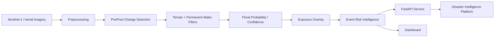

# Platform integration architecture

The public demo uses synthetic raster values locally and a separate Google Earth Engine template for Sentinel-1 GRD. Operational deployment would add event orchestration, cloud storage, model/version registry, logging, alerting, geospatial tiling, independently validated thresholds/models and human review for uncertain regions.
